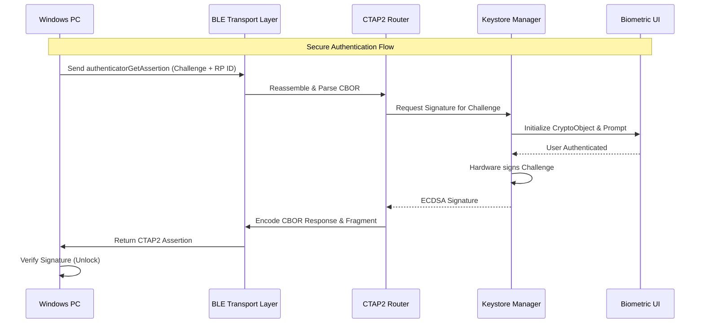

# Phone2PC Architecture

This document describes the high-level architecture of Phone2PC, enforcing a strict separation of concerns and robust security boundaries.

## 1. System Overview

## 2. Core Components & Security Boundaries

### 2.1. BLE Transport Layer (GATT Server)
Handles raw byte transmission over Bluetooth Low Energy.
- **Responsibility:** Advertising FIDO Service (`0xFFFD`), MTU negotiation, and FIDO BLE frame fragmentation/reassembly.
- **Security Constraint:** Must not process payloads. It merely acts as a dumb pipe assembling byte arrays for the CTAP2 Router. Must gracefully handle malformed frames without buffer overflows.

### 2.2. CTAP2 Router & CBOR Parser
Translates binary data into structured requests.
- **Responsibility:** CBOR encoding/decoding and routing based on CTAP2 command bytes.
- **Security Constraint:** Must validate all incoming CBOR structures. Missing required fields (like `clientDataHash` or `rpId`) must result in an immediate CTAP2 error response. 

### 2.3. Keystore Manager
The cryptographic heart of the application.
- **Responsibility:** Key generation, key retrieval, and signing operations.
- **Security Constraint:** 
  - Uses `ECGenParameterSpec("secp256r1")`.
  - Enforces `setIsStrongBoxBacked(true)` where hardware permits.
  - Enforces `setUserAuthenticationRequired(true)`.
  - Enforces `setInvalidatedByBiometricEnrollment(true)` (if a new fingerprint is added to the OS, existing keys are destroyed).

### 2.4. Biometric UI Controller
Handles the user interaction for authorization.
- **Responsibility:** Displaying the `BiometricPrompt`.
- **Security Constraint:** Must wrap the `Signature` object inside a `BiometricPrompt.CryptoObject`. This ensures the Android OS mathematically prevents the signature from occurring unless the biometric hardware successfully verifies the user.

## 3. Threat Model Mitigations
- **Replay Attacks:** Mitigated by the Windows PC sending a cryptographically random challenge in the `clientDataHash`. The Keystore signs this specific challenge, making the signature useless for future login attempts.
- **Stolen Device:** Mitigated by the Keystore being inaccessible without the user's live biometric input.
- **Phishing/Spoofing:** Mitigated by strict verification of the `rpId` (Relying Party ID).
- **Memory Scraping:** Addressed by zeroing out byte arrays (like the `clientDataHash`) immediately after the signing operation is complete.
